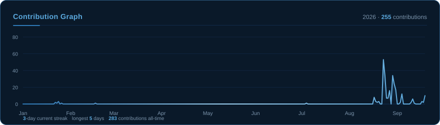
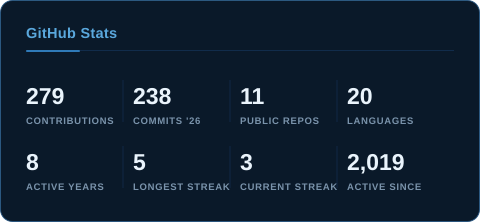
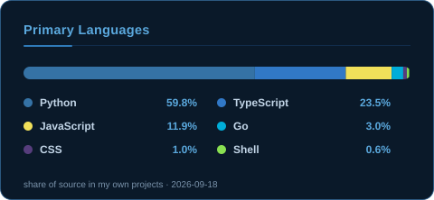
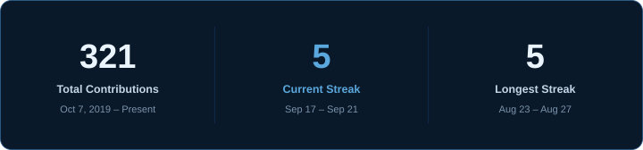
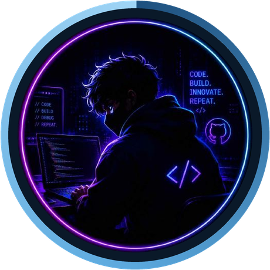

<!-- ─────────────────────────────────────────────────────────────
     GitHub Profile README — @Heinsithukyaw
     Palette: #04080F #0A1929 #14345A #2F7AB8 #5AA8DD #C3D6E8
     All artwork lives in ./assets and is editable SVG.
     ───────────────────────────────────────────────────────────── -->

  

  

<!-- ─────────────  SOCIAL  ───────────── -->

  
  
  
  

 

<!-- ─────────────  TECHNOLOGIES  ───────────── -->

  <h3>Technologies</h3>
  

**Languages**

**Frontend**

**Backend &amp; Data**

**Cloud, DevOps &amp; AI**

 

<!-- ─────────────  STATISTICS  ───────────── -->

  <h3>Statistics</h3>
  

  

  
  

  

Every card above is generated from the GitHub API by <code>scripts/generate-assets.mjs</code> and refreshed daily by a scheduled workflow — no third-party card service, so nothing can go down.

 

<!-- ─────────────  ABOUT ME  ───────────── -->

  <h3>About Me</h3>
  

<table align="center" border="0">
  <tr>
    <td width="230" align="center" valign="middle">
      
    </td>
    <td valign="middle">
      

        Hi — I'm <b>Taungoodev</b>, a software engineer who builds <b>AI agent systems</b> and the
        product surfaces around them. My work sits where <i>agentic automation</i> meets
        <i>real, shipped software</i>: multi-agent orchestration, tool/MCP plumbing, workflow engines,
        and the full-stack apps that make them usable.
      

      

        I work end-to-end — data model and API on one side, interface on the other. Day to day that
        means <b>TypeScript</b> and <b>Python</b> for products and services, <b>Go</b> for
        performance-sensitive services, and <b>PostgreSQL</b> + <b>Docker</b> underneath.
        I care about systems that stay debuggable after month three, not just demos that work once.
      

      

        Currently building: <b>Callme.ai</b> (voice AI calling), <b>DailyNews</b> (community-ranked
        news), <b>PIG</b> (private investment gateway), <b>AgentOS</b> (agent orchestration) and
        <b>Veridra</b> (a writer's studio).
      

    </td>
  </tr>
</table>

 

<!-- ─────────────  FEATURED WORK  ───────────── -->

  <h3>Featured Work</h3>
  

  

 

<!-- ─────────────  HOBBIES & GOALS  ───────────── -->

  <h3>Hobbies &amp; Goals</h3>
  

Building in public · agent architecture · workflow automation · trading &amp; market tooling · open source

<i>“The best way to predict the future is to build it.”</i>

**Goal:** ship agent systems that people actually keep using — and keep the whole thing readable six months later.

 

<!-- ─────────────  FOOTER  ───────────── -->

  

  

  Thanks for stopping by — feel free to explore the repos or reach out.

